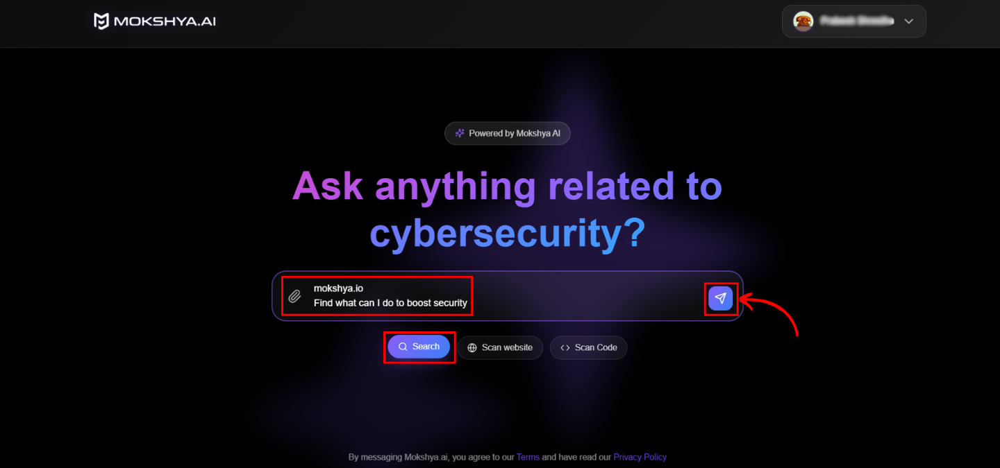

Mokshya AI assists security teams with reconnaissance, providing intelligence before deeper testing.  

### How It Works
1. Use **Search mode** from the homepage.  
2. Enter queries like:  
   - “Analyze this domain”  
   - “List open ports for example.com”  
   - “Discover subdomains for example.com”  

  

### The AI Collects and Organizes Data Like
- Subdomain enumeration  
- Open ports & exposed services  
- Technology stack fingerprinting  
- Basic threat intelligence reports 