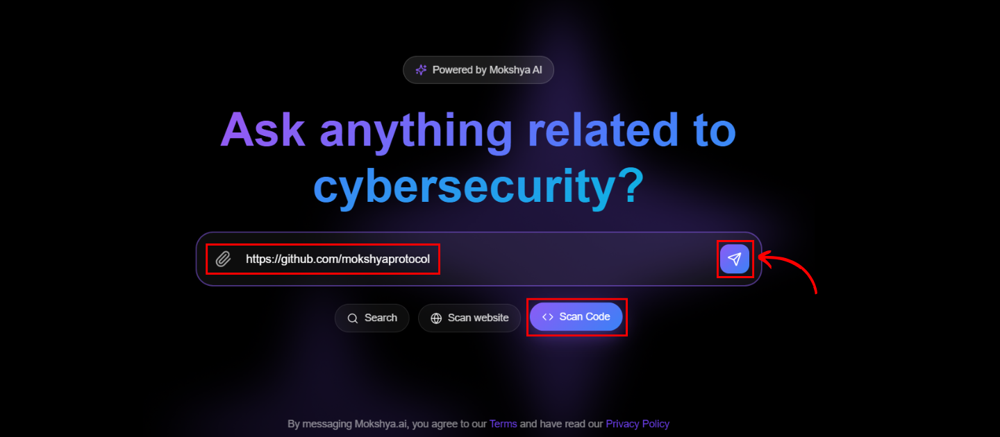

We allow developers and security teams to analyze codebases quickly for flaws and insecure practices.  

### It Identifies
- Insecure coding patterns  
- API misuse  
- Input validation flaws  
- Dependency vulnerabilities  

### How It Works
1. Select the **Scan Code** mode.  
2. Paste a code snippet or upload files/repositories.  
3. The AI performs static code analysis, reviewing logic, syntax, and patterns.  

  

### Results Include
- Line-by-line issue detection (e.g., hardcoded secrets, unsafe functions, missing validations)  
- Severity levels for prioritization  
- Secure coding recommendations with improved examples  
- Highlights affected files and lines with suggested fixes  

Developers can also ask the AI to **rewrite vulnerable code securely** in the same language or framework.