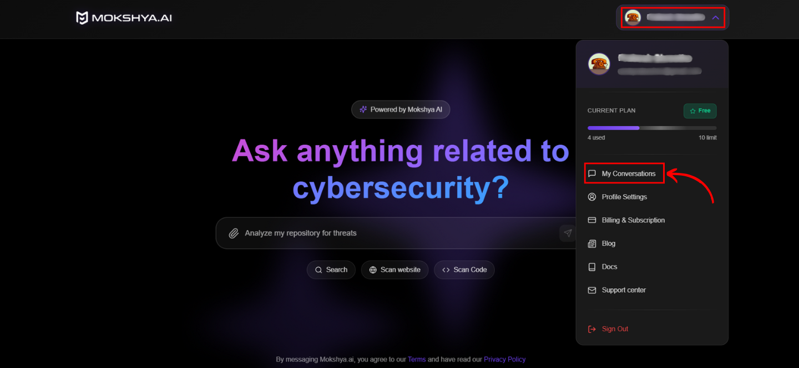
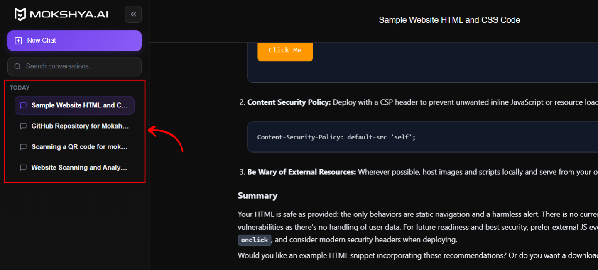
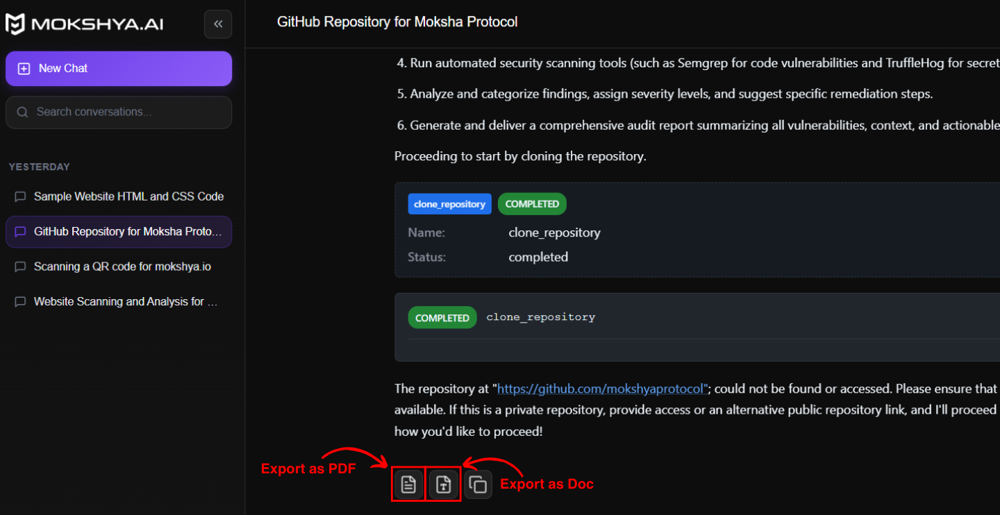

We automatically save all your scans, chats, and generated reports. You can easily access them at any time through your **profile menu**.

On the top-right corner of the homepage, click your profile. A dropdown menu will appear with account options. Click **My Conversations** from the menu.
  

  

You’ll be taken to a list of your saved conversations and scan results.  

Browse the list of saved sessions, organized by date. Use the search bar to find older conversations.  

Click on a conversation to reopen it. Once reopened, you can:  
  

- Continue the chat where you left off  
- Compare findings across different scans  
- Export results as **PDF or doc file**  

  