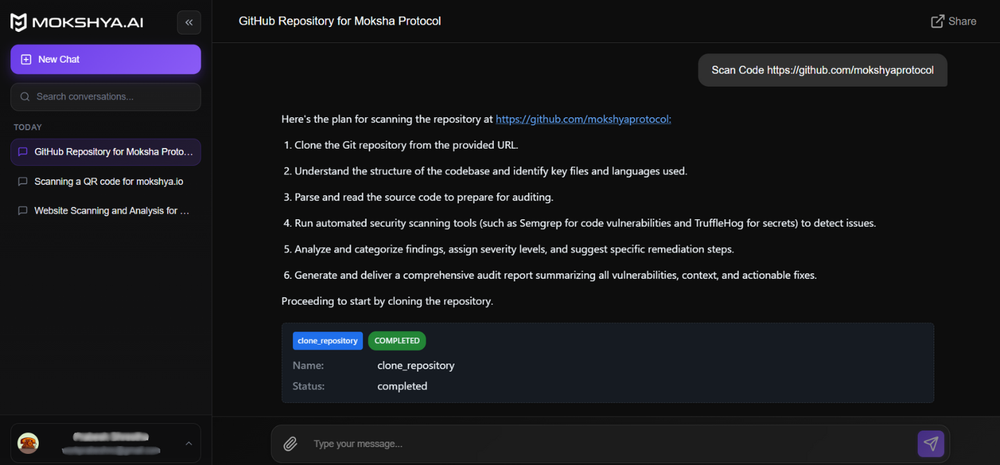

To scan code, go to the homepage and select the **Scan Code** option. Paste your code snippet or repository link in the search box and click **Send**.  

  

The results will appear in the chat panel, showing:  
- Vulnerabilities or insecure coding patterns  
- Severity ratings for each issue  
- Suggested secure coding fixes and best practices  

  

Use the chat to ask for clarifications or improvements (e.g., “show me a fixed version of the code”).  
