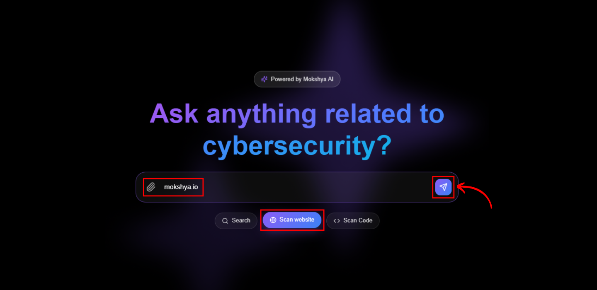
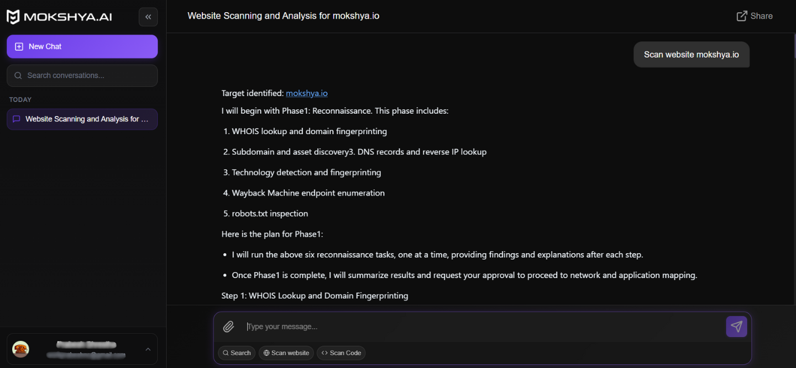

After logging in, in the search bar, enter the URL of your website. Select the **Scan Website** option below the search bar and click on the **Send** button.  

  

Mokshya AI will start analyzing the website for vulnerabilities and misconfigurations.  

  

Results will appear in the chat panel, including:  
- Detected vulnerabilities (e.g., SQLi, XSS, CSRF)  
- Risk levels (technical and business impact)  
- Suggested remediation steps  
- Ask follow-up questions to explore in more detail