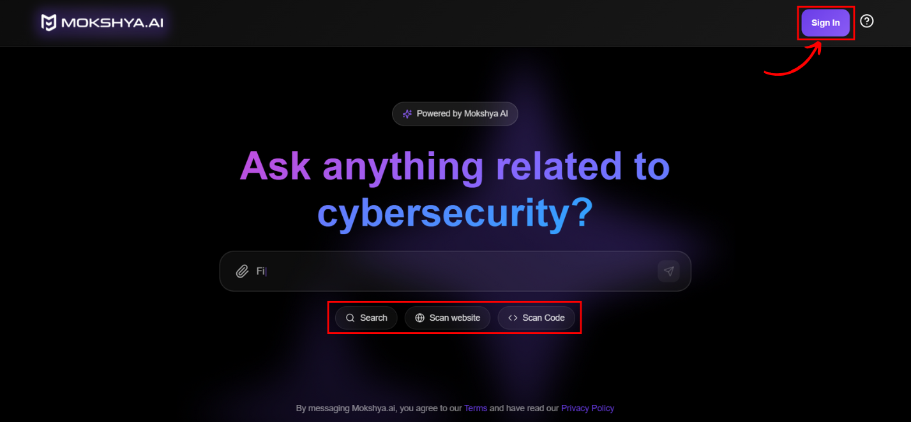
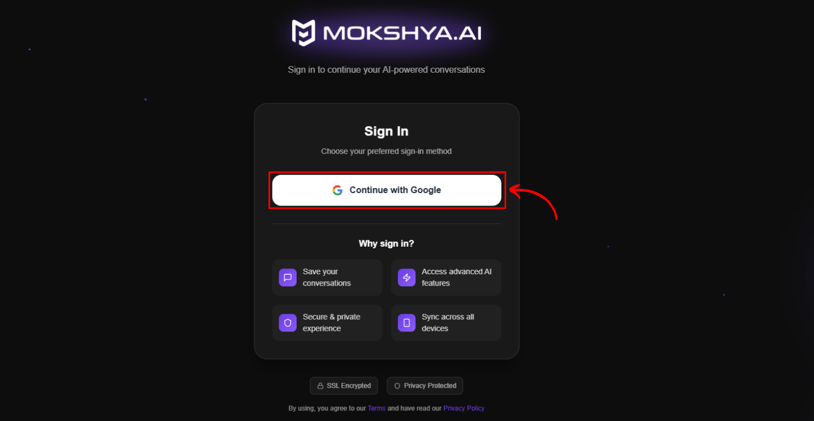

Mokshya AI is fully browser-based and requires no installation. To start using, open [Mokshya AI](https://mokshya.ai/) in your browser.  

A search bar is available with quick modes: **General Search**, **Scan Website**, and **Scan Code**. On the top-right corner, click **Sign In** to begin.  

  

You’ll be redirected to the login page. Select **Continue with Google** as your sign-in method.  

 
Authenticate with your Google account. After successful login, you’ll return to the homepage and can start scanning.  
