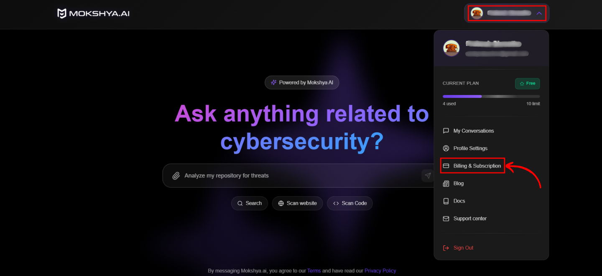
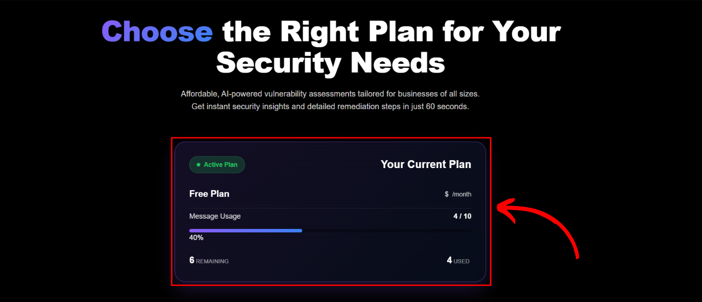
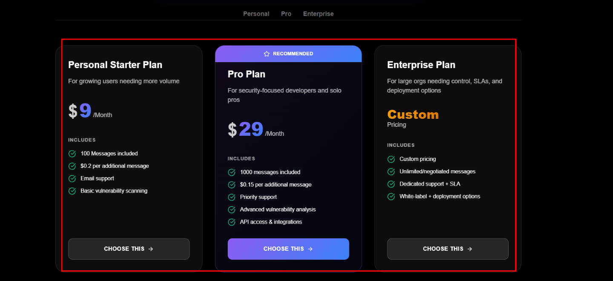
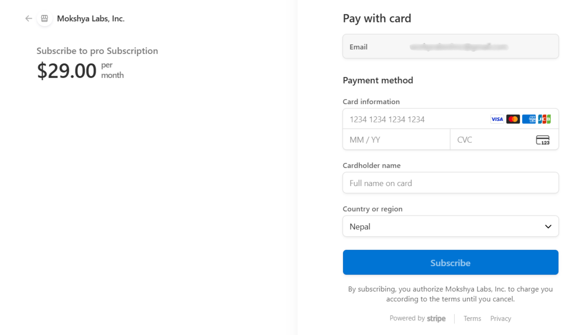

Mokshya AI offers flexible subscription tiers to match different usage needs. You can upgrade anytime directly from the app.  

Click your profile avatar in the top-right corner. In the dropdown menu, check the **Billing & Subscriptions** section.  

  

You’ll see your plan and usage page. This includes:  
- The active plan (e.g., Free, Personal, Pro, Enterprise)  
- Current message usage (e.g., 4 / 10 used)  
- A progress bar showing how much of your allowance is left  
- Remaining messages displayed clearly (e.g., 6 remaining)  

  

Scroll down to view all available plans:  

| Features               | Personal Starter Plan ($9/mo) | Pro Plan ($29/mo) | Enterprise Plan (Custom) |
|-------------------------|-------------------------------|------------------|---------------------------|
| **Messages Included**   | 100                           | 1000             | Unlimited / Negotiated    |
| **Additional Message Cost** | $0.20 per message           | $0.15 per message | Negotiated                |
| **Support**             | Email support                 | Priority support | Dedicated support + SLA   |
| **Vulnerability Scanning** | Basic                        | Advanced         | Enterprise-grade          |
| **API & Integrations**  | N/A                           | Available        | Available (white-label)   |
| **Best For**            | Growing users needing more volume | Security-focused developers & solo professionals | Large organizations needing control & scalability |

  

After selecting a plan and clicking **CHOOSE THIS**, you’ll be redirected to a secure **Stripe checkout** page to complete your payment.  

  